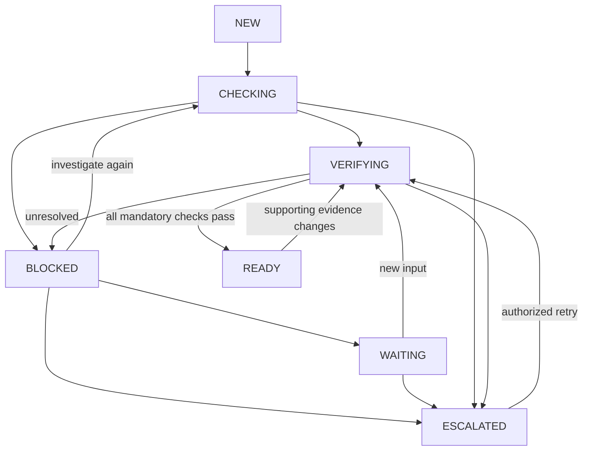

# Architecture

React/Vite/TypeScript presents cases and calls FastAPI through a same-origin `/api` proxy. Backend permission checks, typed schemas and locked transactions own business integrity. PostgreSQL persists identity, policies, cases, documents, evidence facts, conflicts, actions, approvals, jobs and events. Files use relative keys beneath one configured private store. The local inference provider has no database, filesystem or arbitrary tool authority.

## Domain and persistence

Cases reference one immutable template version and retain evidence revisions. Requirement status is a materialized JSON map; source facts, documents, conflicts, actions and immutable audit records are normalized relational entities. Rules support required/optional evidence, accepted field aliases, an expected normalized value, conditional applicability, prerequisite rules and human acceptance. Unknown condition inputs remain ambiguous. Alias alternatives express the same underlying business fact; richer arbitrary AND/OR policy expressions are deferred.

All API object resolution is tenant-scoped. IDs and tenant identities come from the authenticated session. Creation validates referenced templates/users; nested document/fact/action operations validate case association. Workspace-wide read sharing is the current access scope.

The worker claims durable jobs using `FOR UPDATE SKIP LOCKED`, records a bounded lease and locks the case during each specialist transaction. Every checkpoint and finalization checks the current job claim generation, tenant, case, active key, status and lease under lock. Claiming holds only the job lock; execution locks case then job. A failed specialist rolls back its partial transaction before recording failure. Database outages trigger bounded worker backoff. Each successful specialist commits a checkpoint and event; there is no frontend-only execution state. An active-key uniqueness constraint prevents simultaneous queued runs for one case. Recovery is at-least-once; action effects are idempotent. A dead worker’s job can be reclaimed after its lease; after three claims, the case escalates.

## State transitions

READY remains stable for an unchanged evidence/rule snapshot; an authorized run may explicitly reopen it for an integrity recheck. Source mutation reopens verification; it is never a direct manual “set ready” action. Other accepted transitions, including NEW to ESCALATED, are enumerated in `app/domain.py`. Context changes require a reviewer; a policy manager explicitly migrates a case to a new template version.

## Six-agent graph

The implementation uses an explicit persisted state graph, not LangGraph. The PRD allows this choice. Deterministic routing is the Orchestrator’s observation policy: load approved rules if needed, search unsearched sources, compare actual contradictions, plan remaining repairs, execute allowed actions, verify or wait. Complete cases skip conflict/repair/action specialists. The graph’s dispatch trace is recorded before each specialist call. The UI shows those dispatches and summaries, not private reasoning.

Evidence search handles one source per checkpoint. Exact normalized key/value evidence is deterministic. Natural-language evidence is proposed by a model only if its cited quote and value literally occur in the source; it always needs human acceptance. Models also draft bundled clarification messages. Model outage cannot create satisfaction or clear a case; manual proposals and visible error events are retained.

Repair planning computes the closure of mandatory dependencies, reuses existing evidence, avoids asking for a fact blocked only by a prerequisite, preserves unrelated outstanding requests, and groups by owner/action kind. Search is already complete before planning. Effort values (review 3, internal clarification 5, external draft 8) are transparent ranking heuristics, not probabilities or an optimality proof. The initial scope uses a finite set of deterministic investigation capabilities rather than unrestricted model-generated plans.

## Approval and action boundary

Action fingerprints bind kind, complete payload, owner, case/tenant identity, case revision, template ID/hash, and active document IDs/hashes/versions. Approvals record the human actor, decision, comment, fingerprint and expiration. Execution revalidates source state, payload integrity, approval freshness and current approver authority. Material mutation invalidates approvals. Internal request creation is idempotent and separately recorded; replies require assigned owner or reviewer authority and remain candidate evidence. External drafts have explicit approval but no delivery connector.

Reviewers can explicitly supersede contradictory source facts with a recorded justification. No AI waives an expected value, changes a policy, signs for a user or releases payment.

## Source freshness and invalidation

Document replacement retains the original version and marks it inactive. Changes invalidate the affected requirement and dependency closure; uncertain mappings invalidate all requirements conservatively. Incremental evaluation accumulates dirty requirements and their dependency closure across mutations, using the same lexical field parser as extraction. Final READY verification always recomputes all rules (at most 50), independently of cached statuses; search currently rescans the case’s authorized sources after mutation. Approvals conservatively invalidate across case revisions. Unrelated waiting internal requests remain active to prevent duplicate outreach. Verification also checks original-file bytes against recorded hashes. A missing/changed original blocks readiness.

## Live events

The authenticated SSE endpoint streams persisted ordered events and supports cursor reconnect. It checks session/user validity repeatedly, emits heartbeats and closes after 60 seconds; native EventSource reconnects. It does not hold a database transaction while waiting. Event refreshes are debounced; reconnect refreshes canonical state, and five-second polling recovers when streaming fails. The UI displays a reconnect message and never carries an old case response into a different case route. A failed stream does not fabricate progress.

## Deployment boundary

Native API/worker plus PostgreSQL is the simplest Mac setup. Compose also describes API, worker and static Nginx web. Production requires PostgreSQL, HTTPS origin and secure cookies. SQLite is a disposable test harness only. The application has not been benchmarked for large case volumes or multi-server failure modes; use real PostgreSQL concurrency tests before scaling workers.

## Evidence and lifecycle repairs

Exact matches do not suppress remaining narrative extraction. More than 200 exact matches or narrative beyond the 16,000-character model context bound creates a visible manual error without partial acceptance. Contradictory unaccepted candidates block readiness pending review. JSON/CSV cells preserve boundaries through escaping; duplicate keys/headers and malformed row widths are rejected.

Facts distinguish explicit rejection from pending review. Conflicts retain type, severity, expected/observed values, source-linked facts, lifecycle state and resolution attribution. Source mutation marks prior conclusions for revalidation; closed records stay available in history. Partial clarification results retain `answered_requirements`; remaining questions reuse the same request. Rejected governed actions escalate and require authorized retry/replanning.
